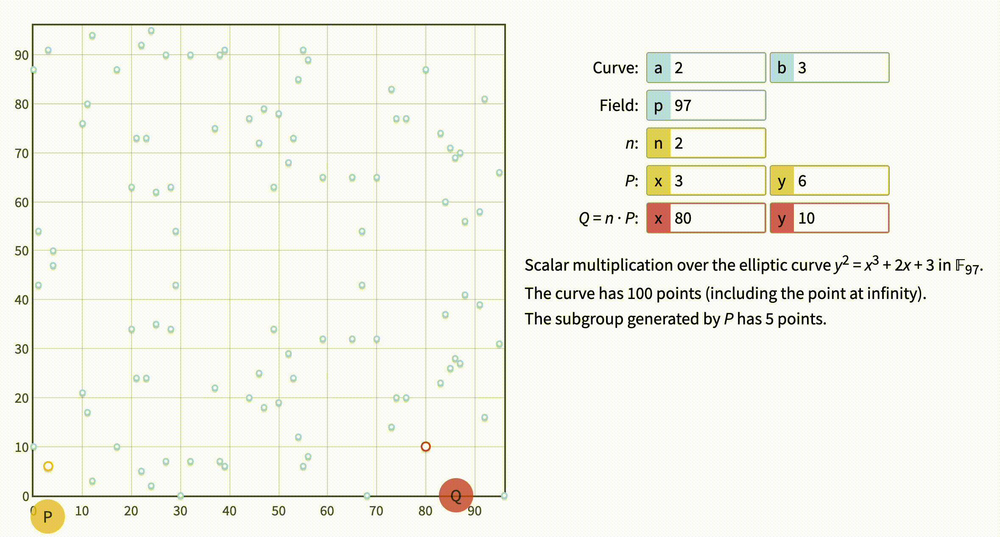

# Bitcoin Cryptography beyond blockchain.


On the web, there is a ton of articles explaining how Bitcoin works. Most of them focus on how blockchain functions. The technology is indeed revolutionary and I hope you already grasp at least some understanding of it. Having that said, what you should understand in order for the article to make sense is that with Bitcoin we have an ultimately public database. This means two things. First, one can read everything about every Bitcoin transaction that ever happened, without asking anyone. Anyone who possesses Bitcoin can send it anywhere. As long as the fee is enough the transaction will eventually be accepted and stored on the database.

## What the heck is asymmetric cryptography and why should I care?


The public nature pleads the question: How come everyone can make sure I own Bitcoin and not be able to spend it instead of me? I mean, if they know my "password" what would stop them from using it? The answer is two words: Asymmetric Cryptography. Those words roughly mean that there's not a single "password", instead there's two "passwords", which are called private key and public key. 
With those keys two cool things could be performed: asymmetric encryption and digital signatures. In this article, we are going to focus on the latter as it is the thing used in bitcoin.

Digital signature means that anyone with **public key** receiving a signed message* can verify that it was signed by the **private key**. At the same time having a public key **will not** allow creating a valid signature. Therefore public key can be shared practically with everyone, hence the word public, while private key should be kept far away from the public eyes, hence people also call it **secret key** or simply **secret**.

> __Signed message__ means the message itself paired with a signature specific to that message.

Although this might not sound that mind-blowing, asymmetric encryption is relatively new by historical measurements. The first take on it, called Diffie–Hellman key exchange was introduced in just 1976. Just a year later, in 1977 probably the most widely used asymmetric encryption algorithm, called RSA (Rivest–Shamir–Adleman) was introduced. The algorithm is used in various systems, most notably HTTPS. However, if you know something about RSA you may know that the keys for the algorithm are huge. Gladly we have much shorter keys in Bitcoin due to a new family of algorithms invented in 1985.

## Elliptic What?

Let's start with the equation deeply embodied in the Bitcoin ecosystem:

$y^2 = x^3 + 7$

If we put it in [desmos](https://www.desmos.com/calculator/ktur7ntzhh) will get the following graph:


The shape is called __elliptic curve__ and are base of the thing called Elliptic Curve Cryptography or ECC. To be precise, the generic ECC equation is  $y^2 = x^3 + + ax + b$, we just have $a = 0 and b = 7$ in the case of Bitcoin.

Another important aspect of ECC is a "finite field". What that means is that we:

1. Define the "finite field size", which is just a number commonly denoted as **p**.
2. For each __integer__ value of X from 0 to **p - 1** calculate the corresponding value of Y. a.k.a find points satisfying the equation
3. If the resulting `y` is not an integer throw the point out
4. If `y` is more than `p` instead of the actual value use remainder from `y / p` a.k.a apply modulo of `p`.

With that understanding visualization in the [webtool](https://andrea.corbellini.name/ecc/interactive/modk-mul.html)
should make sense. Let's set `a = 0, b = 7` to reflect the Bitcoin equation, here's what we get:



Okay, so we are familiar with what `a`, `b` and `p` mean. But there are a few more letters there. What the heck is `P` for example? Well, it's just a point we pick to start our journey called a Generator Point. By the way, the point is normally denoted as `G`, I don't know why the tool decided to use the little confusing `P`. Picked how? Randomly? Is it our private key, finally? Not that fast, although there is no particular calculations for `P` the point is not really random. In fact, we know the exact "coordinates" of the bitcoin generator point. We won't use it now, though. You'll understand why later.

There are just two more things left: `n` (which is normally called `d`) and `Q`. Let's move `n` down to 1 and then up to 8:


 Note that when `n=1` `Q` matched the `P`. Well, that's because `n` is a `multiplier` of the generator point `P`  and a thing multiplied by 1 is the thing itself. And `Q` is obviously the "multiplication" result.

> ⚠️ Don't be fooled by the word "multiplication". It has nothing to do with doing regular algebra multiplication. Instead, it is used in the sense that multiplication is adding to itself a certain number of times. And, of course, addition is not what you may expect either. The addition of points in ECC means drawing a line connecting two points and finding the third point where the line intersects the graph. Remember also we have the "finite field", which makes calculations even more complicated. Long story short, under the term "multiplication" hides twisted calculations that can not even be explained in a formula.

Note, also, how unpredictably the result `Q` changes when we increase our "multiplier" `n`. That's one of the things making the elliptic curve suitable for asymmetric cryptography: It's pretty easy to calculate `Q` from `n`, but hard to figure out `n` from `Q`. With the hint you may guess that `n` it is exactly our **private key**. And `Q` is the **public key**.

Let's go through was this means one more time. Let's say we are building a public "network" like Bitcoin. We decide to use ECC for digital signature. Next, we announce which exact "Curve" we are using. Curve basically means values of `a`, `b`, `p`, and `P` (a.k.a. `G`). So let's say this is our curve:

```
a = 0
b = 7
p = 97
P/G = (17; 19)
```

Let's say John wants to join. The first thing he needs to do is to come up with **his own** secret. John picks `8`. The next thing John needs to do is to calculate **his** public key: `(57; 30)`. Now, John wants to say "Hi" to our network. Using our curve again John calculates a `signature` for the message "Hi". Let's say the signature John got is `999`. This is what John now sends to our network:

```yaml
publicKey: (57; 30)
message: "Hi"
signature: 999
```

In our network there's a pool of people accepting the messages, we call them miners in the Bitcoin world. A "miner"  checks that:

> The signature `999` for the message `Hi` can only be produced by someone knowing the private key corresponding to the public key `(57; 30)`

If that's true a.k.a signature is verified, the miner __must__ accept the message. If it's not the miner __must__ reject the message.

> What's also important in the context of Bitcoin is that there's **everyone** can become a miner without asking anyone's permission. This is the magic of blockchain we agreed to not touch upon at the beginning of the article. The "magic" is also why miner **must** (read forced) to follow the exact message verification process.

## When using quinvigintillion makes sense

There are a few obvious problems with "our network", however:

1. It's actually very easy to figure out our private key using good-old brute force. 
2. There are not many points to pick from, so the probability of someone picking the same key as John is very high.
3. Beyond brute-force there are also a few clever math techniques to figure out public key `Q` from private key `n`.

Fortunately, there's a simple thing we can do to solve the first two problems: Make our field bigger! So let's significantly increase our `p`. How many times? Twice? Thousand times? A billion three hundred million trillion three hundred million times? You are the closest, Joe! Just above a hundred quinvigintillion. Here's the actual number:

`115792089237316195423570985008687907853269984665640564039457584007908834671663`

As you may understand, we won't be able to use the number in a visualization tool. Let's get back to it with our good old tiny numbers and try setting `n` to the numbers: `1, 2, 3, 80, 81, 82`.


Note that 1 produces the same point as 80, 2 produces the same point as 81, and 3 produces the same point as 82. Notice the phrase "The curve has 79 points". The number of points is called the curve order and one of the other peculiarities of the ECC field is its cyclic nature. Which **roughly** means `multiplicator + curve order = multiplicator` or in our example `1 + 79 = 80`, `2 + 79 = 81` and `3 + 79 = 82`.

> The curve order is commonly denoted as `n`. But in the visual tool, the letter is already used for our private key / our multiplicator. In all the other places I saw the value of the private key/multiplicator is denoted `d`.

What this means is that the amount of points in the field is equal to the number of distinct keys we can generate a.k.a key space. For Bitcoin, that number is $$2^{256}$$ a.k.a 256-bits or `115792089237316195423570985008687907853269984665640564039457584007913129639936`, which as you may see is an extremely huge number. This makes our problem #2, the collision of the private key improbable.

Now, remember that we also have problem number 3 with some smart people attacking our cryptography with clever math techniques. Perhaps the most important thing is to pick a good field size `p`. Note, that beyond being big it's important for `p` to be a prime number. In fact, it's that important that the visualization tool will not let us pick a non-prime number and the name `p` comes from the word `prime`. Another important aspect is to pick a good generator point. Remember I didn't use Bitcoin's generator point for our experiments. Well, to explain the reason let me just show you that point:

```
(
    55066263022277343669578718895168534326250603453777594175500187360389116729240;
    32670510020758816978083085130507043184471273380659243275938904335757337482424
)
```

Okay, that's the last number in the article and while the numbers fear fades away, let's talk about where did they come from? Did Satoshi just pick them out of thin air? Not really. Moreover, the numbers are not specific to Bitcoin. The numbers come from the curve called **secp256k1** - where **sec** stands for "Standards for Efficient Cryptography", **p** comes from the fact that a finite field size is a prime number, **256** refers to the key size, **k** means it's a Kobiltz curve and **1** is just an additional identificator.

The key size of **256** provides seemingly sophisticated security, keeping the keys relatively compact and computation relatively efficient. So, the key size can be easily understood for a cryptocurrency. However, there's a way more popular 256-bit algorithm, which is known by many names: secp256r1, P-256, NIST P-256, prime256v1. Using a more widespread algorithm might sound like a good choice. However, the algorithm was developed by NIST - the National Institute of Standards and Technology, which is a physical sciences laboratory and a non-regulatory agency of the United States Department of Commerce.

And one of the things Snowden's feat revealed to us is that NIST had been compromised by the National Security Agency (NSA). Specifically, Snowden revealed that the NSA had influenced the development of cryptographic standards and technologies to include vulnerabilities or backdoors that could potentially weaken the security of these systems, allowing for easier surveillance or exploitation by intelligence agencies. And, in fact, the Dual_EC_DRBG (Dual Elliptic Curve Deterministic Random Bit Generator) algorithm, which was included as a standard by NIST in 2006 did contain a potential backdoor that could be exploited by intelligence agencies. 

So although, **secp256r1** is not revealed to contain vulnerabilities, trusting NIST seems like a risky move for such an important system as bitcoin. So, while we don't know why Satoshi did pick **secp256k1** it seems like a good decision. Canadian Certicom, responsible for the development is at least not known to be compromised now. And let's hope that won't change in the future.

## One more question...

But wait, if I generate a bitcoin private key and address it does not look like a number or a point. That's right, it doesn't. But, to describe how all that works will need a whole another article. There's just one spoiler: Your address **is not** your public key. Maybe some day I'll write the next part, for today just trust we that your private key is indeed just a large number, presented in a nice format.
