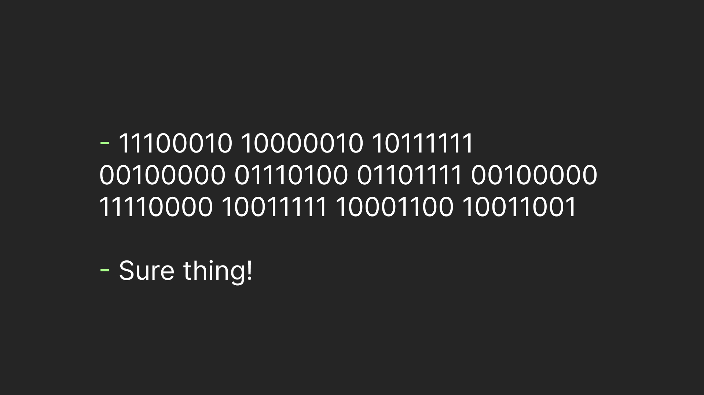

# How to talk in 1s and 0s?



You've probably heard a few times that computers talk in 1s and 0s. But we know they "talk" about a lot of things, right? How do they exchange text for example? I understand they convert text into 1s and 0s, but how? That's the question I recently find myself answering.

I did describe the process on a high level, and the person asking even looked satisfied with my answer. However, I felt that my explanation was vague and had a few blind spots. So I decided to study the topic myself and give it another try, this time in writing. In this attempt besides a clear general explanation of the concept, I aim to explain __exactly__ how it plays out in real life.

> Besides that I'll try to give you an explanation for the words you may face when studying this or a related topic. The words we'll need right away are **bits** and **binary**. A bit is a thing that can hold exactly two states - 0 or 1 for example. So we might, as well, say that computers talk in bits. And since a bit sequence is a sequence of things that can be one of two the sequence is called binary sequence, or simply **binary**.

## Creating an encoding

Perhaps, the best way to understand something is to build it. That's exactly what we are going to do. We'll create a system to convert the string into a binary sequence a.k.a. **encode** the string, and then receiving the binary sequence convert it back to the string a.k.a **decode** the binary sequence. Unoriginally, the types of "systems" are called **encoding**.

For simplicity's sake let's limit our alphabet to 8 symbols:

| Char | Code In Decimal | Code in binary |
|------|-----------------|----------------|
| A    | 0               | 0              |   
| B    | 1               | 1              |
| C    | 2               | 10             |
| D    | 3               | 11             |
| E    | 4               | 100            |
| F    | 5               | 101            |
| G    | 6               | 110            |
| H    | 7               | 111            |

Now let's say I wanted to highlight that we are hackers now and decide to send you "HAC". This is what I'll get: 

`H A C -> 111 0 10`. 

But remember we can only talk in 1s and 0s not in 1s 0s and spaces. So what you actually receive is 

`111010`

Since there's no rule on how you split the sequence you split it randomly:

`11 10 1 0 -> D C B A`

Okay, you wouldn't get what I wanted to say. Something is clearly broken. Let's fix it. So we may notice that the max amount of bits we want to use to encode a symbol is 3. How about we just stick zeros on the left side so that every char is exactly 3 bits in length? Or as they call it **apply padding**.

| Char | Code In Decimal | Code in binary |
|------|-----------------|----------------|
| A    | 0               | 000            |   
| B    | 1               | 001            |
| C    | 2               | 010            |
| D    | 3               | 011            |
| E    | 4               | 100            |
| F    | 5               | 101            |
| G    | 6               | 110            |
| H    | 7               | 111            |

Okay, so my technique wouldn't really change: I'll just look up every character's binary code and use it:

`H A C -> 111 000 010`

And this is what I'll actually send.

`111000010`

But what you as a decoder will do now is split the sequence by the chunks of 3. And now there's no ambiguity in the decoding mapping:

`111 000 010 -> HAC`

Now you get exactly what I sent you. That logic sounds easy, but still sophisticated enough, right? That is because it is. In fact, this encoding logic is exactly the logic used in the encoding dominant from the mid-1960s to the early 1990s, called **ASCII**. Of course, the ASCII table consisted of more than just 8 symbols. Since A in ASCII stands for American they only included 52 letters: 26 uppercase and 26 lowercase English letters, 10 digits, and 33 other symbols, including the dollar sign, of course. And 33 spots were allocated for invisible characters, like backspace and tab. They call them **control characters**.

> Funny enough, there are 2 characters indicating a new line: LF (Line Feed) is used in Unix systems (including Linux and macOS) and CR (Carriage Return) in the old Mac version. Microsoft decided not to choose, so Windows uses CR+LF.

## Introducing clever rules. UTF-8

In total ASCII consists of 128 characters. This is 2 (the number of states a bit can have) powered by 7 (the number of bits it is needed to encode a character). But having an encoding with only English letters obviously couldn't last long. The world needed many more symbols. How many? "A MILLION!" - someone screamed. And that's how UTF-8 was born.

> The big numbers desire wasn't too lunatic. In fact, in the encoding version 15.0, there are 149,186 assigned characters. And although that's still far away from its capacity (of 1,114,112 characters) it is probably way more than you expected.

But with that number of symbols using padding would be too wasteful - almost every message will consist mostly of useless zeros. So UTF-8 used another idea: Use the first bits to tell how many bits to read after. The design of UTF-8 made it a **variable-length encoding**, unlike ASCII which is a **fixed-length encoding**. Need more details? Let's go straight to an example! This time, we won't use an artificial case, we'll use a real UTF-8 sequence. Moreover, let's pick a pretty hard-core one:

```
 
```

The number 8 in the name indicates that the work is going to be performed upon the chunks of 8 bits. So our first step is easy: Split the thing up!

> A sequence of 8 bits is called a **byte**. And if computers are 'native' in bits, they are at least upper-intermediate in bytes.

```
11100010 10000010 10111111 00100000 01110100 01101111 00100000 11110000 10011111 10001100 10011001
```

Now the main idea of UTF-8 comes into play. We'll use the first bits of a byte to figure out how many bytes we'll need to read after. For example, if our byte starts with `0` the number of bytes we need to read is equal to 1, which means we'll read just that byte. If the **leading byte** starts with `110` we'll need to read 2 bytes: this byte and the next one. Here's the complete UTF-8 rule set:

| Leading Bytes Pattern | Number of Bytes to Read |
|-----------------------|-------------------------|
| 0xxxxxxx              | 1                       |
| 110xxxxx              | 2                       |
| 1110xxxx              | 3                       |
| 11110xxx              | 4                       |

Let's use this for our example! The first byte starts with `1110` so we'll put the first 3 bytes in the first 'box', which is our character number one, or `char 1` for brevity.

```yaml
char 1: 11100010 10000010 10111111

remaining: 00100000 01110100 01101111 00100000 11110000 10011111 10001100 10011001
```

The next byte start from `0` so we'll allocate only this byte in the next box

```yaml
char 1: 11100010 10000010 10111111
char 2: 00100000

remaining: 01110100 01101111 00100000 11110000 10011111 10001100 10011001
```

The story repeats three more times, so we get:

```yaml
char 1: 11100010 10000010 10111111
char 2: 00100000
char 3: 01110100
char 4: 01101111
char 5: 00100000

remaining: 11110000 10011111 10001100 10011001
```

The next sequence starts with `11110` bytes, which means all 3 remaining bytes are part of a single character.

```yaml
char 1: 11100010 10000010 10111111
char 2: 00100000
char 3: 01110100
char 4: 01101111
char 5: 00100000
char 6: 11110000 10011111 10001100 10011001
```

Besides, the rule of how to know how many bytes to read there's one more rule. The rule of which bits are actually important. And this is what the rule looks for UTF-8:

| Number of Bytes | Format                                |
|-----------------|---------------------------------------|
| 1               | 0xxxxxxx                              |
| 2               | 110xxxxx 10xxxxxx                     |
| 3               | 1110xxxx 10xxxxxx 10xxxxxx            |
| 4               | 11110xxx 10xxxxxx 10xxxxxx 10xxxxxx   |

The format basically means throw out everything that is not in the position of `x`. So if we do it carefully we'll get

```yaml
char 1: 0010 000010 111111
char 2: 0100000
char 3: 1110100
char 4: 1101111
char 5: 0100000
char 6: 000 011111 001100 011001
```

And the thing we got is the actual UTF-8 character codes. Almost. UTF-8 codes actually represented using **hex**. So let's use [the online tool](https://www.binaryhexconverter.com/binary-to-hex-converter) to convert our binaries to hex.

> What the hex? you may ask. Pun intended. Well, hex is short for hexadecimal and it basically means representing a number with A meaning 10, B meaning 11, C - 12, D - 13 -, E - 14, and F - 15. Going deep into hex is out of the scope of this article. Fortunately, the online tool above provides a sophisticated explanation of hex so feel free to dive deep into their explanation if you'd like.

```yaml
char 1: 20BF
char 2: 20
char 3: 74
char 4: 6F
char 5: 20
char 5: 1F319
```

Now if we'll [search UTF-8 characters by their hex codes](https://unicodeplus.com/).

> The actual UTF-8 table is too big to even fit on a single web page.

We'll be able to get that:

```yaml
char 1: 20BF -> '₿'
char 2: 20 -> ' ' (Space)
char 3: 74 -> t
char 4: 6F -> o
char 5: 20 -> ' ' (Space)
char 5: 1F319 -> '🌙'
```

So the sentence we got is: "₿ to 🌙".

> Yes, emojis are also part of the UTF-8!

## TLDR

We did a few cool things in this article, learning a few clever-guy words along the way. Let's recap what we did exactly using a clever-guy-language:

1. Created a **bits** to text **fixed-length encoding** with help of **padding**, analogues to **ASCII**.
2. Picked a **binary-sequence** of **variable-length**, **byte**-based **UTF-8** encoding.
3. **Decoded** that sequence using **leading bytes pattern** and **hex**-based codes.
*. Learned that encoding **chars** includes various things from **control characters** to emojis. 

So for the AI takeover, it gives us at least the basics of computer "language" 😉.

# Proposed Structure

- [ ] Introduction
    - [ ] Mention the thesis of a computer talking in 1s and 0s
    - [ ] Propose asking how would we pass a message like "Hello" (pick something illustrative for the padding problem). 
- [ ] Naive Encoding and ASCII
    - [ ] Assign codes to a few letters: create 3-bit encoding
    - [ ] Encode the message (naive way).
    - [ ] Decode the message incorrectly (highlighting the problem).
    - [ ] Propose padding.
    - [ ] Encode and decode correctly
    - [ ] Note that we just created/reproduced ASCII, with notice that it consisted of more characters.
    - [ ] Decode "Hi" using the real ASCII encodings.
- [ ] UTF-8
    - [ ] Highlight that ASCII only included English letters and that this was not enough
    - [ ] Highlight that if we use fixed-size encoding it will probably be too redundant
    - [ ] Explain what UTF did instead
    - [ ] Decode a message from two non-ASCII characters.
    - [ ] Decode an actual message.
- [ ] Recap
    - [ ] Here's how you talk in bytes: You map 7 0s and 1s to our "real" symbols and send chuncks of 7 bits instead of the actual symbols
    - [ ] If you want to get fancy before sending the actual "code" send information about how long the code will be. That What UTF-8 did.
    - [ ] TLDR hex. And tell that explaining "What the hex? (the pun intended)" is out of the scope of this article.
    - [ ] Say that for now you just cover basics "So for the AI takeover you know the basics of computers "language" 😄."
