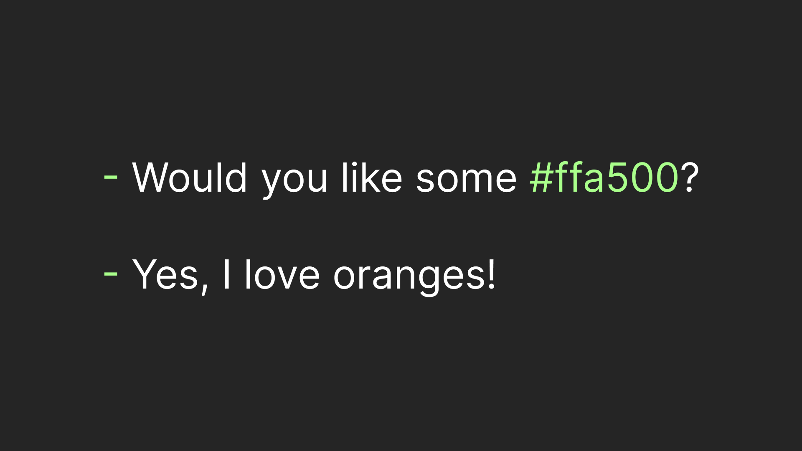
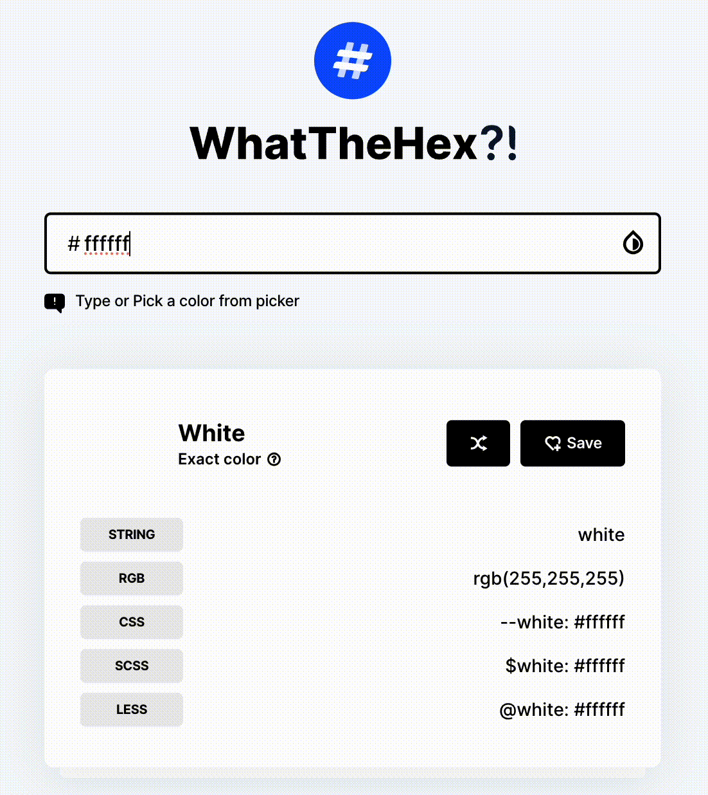

## Binary to text: Hex

If computers talk in 1s and 0s how do they exchange something meaningful? That was the question  I tried to answer in the [previous article]() about text encoding. Based on the information from that article let's formulate a list of steps we need to create an encoding:

1. Decide **how** to create the **thing** we want. 

Sounds simple, right? But there's a catch! The creation process _must_ create our "thing" from numerical values (our input). For example, for text, we one by one read character codes (which are numerical), find their respective characters, and output them.

2. Decide **how** to put the input values in bits so that a reader can understand where each input value is.

There are a few solutions for how to do this with text, which I described in the [text encodings article](). Long story short, in ASCII you always read exactly 7 bits, in UTF-8 you read the first bits to understand how many to read after.

3. **Optional**. Decide how to represent the bits so that __human__ could share them.

And this step is the main topic we are going to discuss. Although this is somewhat useless for text (since humans are good at the text itself) it becomes useful when we want to exchange something more fancy, like color, for example.

## How the hex do I pass a color?

Of course, we can use the good old words. However, understanding of color words is very subjective and contextual. What if we want to pass an exact color? This is where the RGB color model steps in. This is "how to create the thing we want" (which is color in this case):

1. Prepare 3 paint bins each 255 ~cm~ high.
2. Prepare an absolutely black canvas.
3. Put red paint in the first bin. (R)
4. Put green paint in the second bin. (G)
5. Put blue paint in the third bin. (B)
6. Mix the paints from each bin.
7. Put the mix on the black canvas.

Essentially the only thing we **choose** is how much paint to put in each bin. How do I get the white from each? Fill every bin to its fullest a.k.a `rgb(255, 255, 255)`. What about black? Put nothing in the bin a.k.a `rgb(0, 0, 0)`. 

Note that we __must__ have a black canvas, so it's not an input value. That leaves us with just 3 values: how much red paint we put in, how much green paint we put in, and how much blue paint we put in. Note that each value is numerical and ranges from 0 to 255, which is 256 possible values. 

Let's move to the next question of encoding: **How** to put the input values in bits so that a reader can understand where each input value is? Since each input value has the same "capacity" the solution is very simple:

> To represent 256 possible values we need exactly 8 bits (2 ^ 8 = 256)

1. 1st to 8th bit for amount of red paint (R)
2. 9th to 16th bit for amount of green paint (G)
3. 17th to 24th bit for the amount of blue paint (B)

Great! Now, to the last step - let human exchange bits for colors. Note, that 256 = 16 * 16. Okay, how is it relevant? Well, imagine if we have 16 digits instead of our good old 10 (0, 1, 2, 3, 4, 5, 6, 7, 8, 9). Then we could represent the amount of each paint by just 2 symbols, which would be cool, isn't it? Turns out a "system" with 16 digits exists and it's called **hex**, short for hexadecimal. It just uses a for 10 in decimal, b for 11, c - 12, c - 13, e - 14, and f - 15 (giving a total of 16 symbols).

Okay, what do we do with it? Let's encode ochre, using [this tool](https://whatthehex.app/):

Here's how it goes:

1. We'll start with `Yellow`. Which as you may know mix of red and green. So full for red (ff), full for green (ff), and none for blue (00)
2. Of course ochre is not that bright color. Let's roll down colors down, so `cc` for red, `cc` for green, and still nothing for blue `00`
3. Ochre is also rather red-ish then green-ish. Let's decrease green to `77`.
4. Okay, a deep color probably wouldn't completely ignore a primary color. So, as the last touch, let's put just a little of blue: `22`.

## Recap

In the [previos encoding article]() I've described how computers see a text behind 1s and 0s. This time we talked about slightly more complicated thing: how do they see color. Having that, we studied a binary to text encoding, called hex, that helps communicate exact colors in a way that understandable both by computer and humans. So now we are even more ready for the AI takeover 😄 